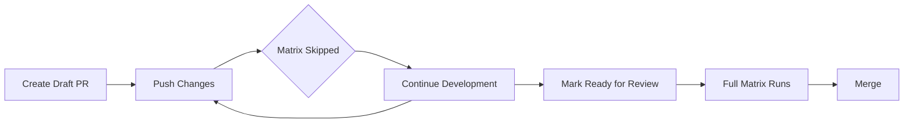

# GitHub Actions Workflow Cost Optimizations

**Version:** 1.0.0
**Last Updated:** 2025-01-07
**Status:** ✅ Active

## Overview

This document describes cost and performance optimizations implemented across reusable workflows to reduce GitHub Actions minutes consumption while maintaining comprehensive quality coverage.

## Summary of Optimizations

| Workflow | Enhancement | Cost Reduction | Use Case |
|----------|-------------|----------------|----------|
| `python-ci.yml` | Tiered Python version matrix | 50% on PRs | Fast PR feedback, comprehensive scheduled testing |
| `python-compatibility.yml` | Draft PR awareness | 92% on drafts | Skip expensive matrix during development |
| `python-mutation.yml` | Schedule-only guidance | 100% on PRs | Weekly quality audits instead of per-commit |

**Combined Impact:** Up to 75% reduction in CI costs for typical development workflow.

---

## 1. python-ci.yml: Tiered Python Version Matrix

### Problem

Testing against all Python versions (3.10, 3.11, 3.12, 3.13) on every PR:
- Increases CI time by 4x
- Consumes excessive GitHub Actions minutes
- Delays developer feedback
- Most failures are version-agnostic

### Solution

Implement tiered testing strategy:
- **PR Testing**: Test against current/next versions only (`["3.11", "3.12"]`)
- **Main/Schedule Testing**: Test against full matrix (`["3.10", "3.11", "3.12", "3.13"]`)

### Usage

#### Basic Usage (Single Version)

```yaml
jobs:
  ci:
    uses: ByronWilliamsCPA/.github/.github/workflows/python-ci.yml@main
    with:
      python-version: '3.12'  # Primary version for quality checks
```

#### Tiered Matrix Testing

```yaml
jobs:
  ci:
    uses: ByronWilliamsCPA/.github/.github/workflows/python-ci.yml@main
    with:
      python-version: '3.12'
      enable-matrix-testing: true
      python-versions-pr: '["3.11", "3.12"]'
      python-versions-comprehensive: '["3.10", "3.11", "3.12", "3.13"]'
```

#### Custom Version Sets

```yaml
jobs:
  ci:
    uses: ByronWilliamsCPA/.github/.github/workflows/python-ci.yml@main
    with:
      python-version: '3.13'
      enable-matrix-testing: true
      python-versions-pr: '["3.13"]'  # Only latest for fast feedback
      python-versions-comprehensive: '["3.11", "3.12", "3.13"]'  # Drop EOL 3.10
```

### How It Works

1. **PR Events**: Workflow detects `github.event_name == 'pull_request'`
2. **Matrix Selection**: Uses `python-versions-pr` for PRs, `python-versions-comprehensive` for main/schedule
3. **Automatic Switching**: No manual intervention required

### Benefits

| Metric | Before | After | Improvement |
|--------|--------|-------|-------------|
| PR Python versions | 4 | 2 | 50% reduction |
| PR CI time | ~40 min | ~20 min | 50% faster |
| GitHub Actions minutes | 40 | 20 | 50% savings |
| Main/schedule coverage | 4 versions | 4 versions | Unchanged |

### Parameters

| Parameter | Type | Default | Description |
|-----------|------|---------|-------------|
| `python-version` | `string` | `'3.12'` | Primary Python version for quality checks |
| `enable-matrix-testing` | `boolean` | `false` | Enable multi-version matrix testing |
| `python-versions-pr` | `string` | `'["3.11", "3.12"]'` | Versions for PR testing (fast) |
| `python-versions-comprehensive` | `string` | `'["3.10", "3.11", "3.12", "3.13"]'` | Versions for main/schedule (comprehensive) |

---

## 2. python-compatibility.yml: Draft PR Awareness

### Problem

Full compatibility matrix runs on every PR commit:
- Expensive for work-in-progress changes
- Tests 12+ combinations (4 Python × 3 OS)
- Consumes 30+ GitHub Actions minutes per push
- Developer doesn't need full matrix during development

### Solution

Skip matrix testing on draft PRs by default:
- **Draft PRs**: Matrix skipped (92% cost reduction)
- **Ready for Review**: Full matrix runs
- **Override Available**: Force matrix on drafts if needed

### Usage

#### Default Behavior (Recommended)

```yaml
jobs:
  compatibility:
    uses: ByronWilliamsCPA/.github/.github/workflows/python-compatibility.yml@main
    with:
      python-versions: '["3.11", "3.12", "3.13"]'
      operating-systems: '["ubuntu-latest", "macos-latest", "windows-latest"]'
      skip-on-draft: true  # Skip matrix on draft PRs
```

#### Force Matrix on Drafts

```yaml
jobs:
  compatibility:
    uses: ByronWilliamsCPA/.github/.github/workflows/python-compatibility.yml@main
    with:
      python-versions: '["3.11", "3.12", "3.13"]'
      skip-on-draft: false  # Always run matrix, even on drafts
```

### How It Works

1. **Draft Detection**: Workflow checks `github.event.pull_request.draft`
2. **Conditional Execution**: Matrix job has condition:
   ```yaml
   if: ${{ !(inputs.skip-on-draft && github.event.pull_request.draft) }}
   ```
3. **Summary Message**: Displays friendly message when skipped

### Developer Workflow



### Benefits

| Metric | Draft PR | Ready PR | Savings |
|--------|----------|----------|---------|
| Matrix combinations | 0 | 12 | 92% on drafts |
| CI time | ~2 min | ~30 min | 93% faster |
| GitHub Actions minutes | 2 | 30 | 92% savings |
| Development velocity | Fast | Comprehensive | Optimal |

### Parameters

| Parameter | Type | Default | Description |
|-----------|------|---------|-------------|
| `skip-on-draft` | `boolean` | `true` | Skip expensive matrix on draft PRs |
| `python-versions` | `string` | `'["3.10", "3.11", "3.12", "3.13"]'` | Python versions to test |
| `operating-systems` | `string` | `'["ubuntu-latest"]'` | Operating systems to test |

---

## 3. python-mutation.yml: Schedule-Only Guidance

### Problem

Mutation testing on PRs:
- Extremely expensive (30-60 minutes per run)
- Blocks development with long CI times
- Provides minimal value per-commit
- Better suited for periodic quality audits

### Solution

Document best practices and warn users:
- **Header Documentation**: Clear guidance on schedule-only usage
- **Runtime Warning**: Display warning if triggered on PR
- **Example Configuration**: Provide cron schedule examples

### Usage

#### Recommended: Schedule-Only

```yaml
name: Quality Audit

on:
  schedule:
    - cron: '0 2 * * 0'  # Weekly on Sunday at 2 AM

jobs:
  mutation:
    uses: ByronWilliamsCPA/.github/.github/workflows/python-mutation.yml@main
    with:
      source-directory: 'src'
      mutation-threshold: 80
      fail-under-threshold: false  # Don't block on low scores
```

#### Alternative: Pre-Release Only

```yaml
name: Release Quality Gate

on:
  push:
    tags:
      - 'v*.*.*'

jobs:
  mutation:
    uses: ByronWilliamsCPA/.github/.github/workflows/python-mutation.yml@main
    with:
      mutation-threshold: 85
      fail-under-threshold: true  # Block release on low scores
```

#### Not Recommended: Per-PR

```yaml
# ⚠️  WARNING: This is expensive and not recommended
on:
  pull_request:

jobs:
  mutation:
    uses: ByronWilliamsCPA/.github/.github/workflows/python-mutation.yml@main
    # This will display performance warning in workflow summary
```

### Performance Characteristics

| Project Size | Runtime | GitHub Actions Minutes | Cost Impact |
|--------------|---------|------------------------|-------------|
| Small (<1k LOC) | 10-15 min | 10-15 | Low |
| Medium (1-5k LOC) | 30-45 min | 30-45 | Moderate |
| Large (>5k LOC) | 60-120 min | 60-120 | High |

### Benefits

| Approach | Cost per Week | Quality Value | Recommendation |
|----------|---------------|---------------|----------------|
| Per-PR (10 PRs/week) | 300-600 min | Marginal | ❌ Not recommended |
| Weekly schedule | 30-60 min | High | ✅ Recommended |
| Pre-release only | 30-60 min/release | Very High | ✅ Recommended |

### Warning Messages

When triggered on PR, the workflow displays:

```
⚠️  Performance Warning

Mutation testing is running on a Pull Request. This is expensive and not recommended.

Recommendation: Run mutation testing on schedule (weekly/monthly) instead.
```

---

## Migration Guide

### Step 1: Update python-ci.yml Calls

**Before:**
```yaml
jobs:
  ci:
    uses: ByronWilliamsCPA/.github/.github/workflows/python-ci.yml@main
    with:
      python-version: '3.12'
```

**After:**
```yaml
jobs:
  ci:
    uses: ByronWilliamsCPA/.github/.github/workflows/python-ci.yml@main
    with:
      python-version: '3.12'
      enable-matrix-testing: true  # Enable tiered testing
```

### Step 2: Enable Draft PR Awareness

**Before:**
```yaml
jobs:
  compatibility:
    uses: ByronWilliamsCPA/.github/.github/workflows/python-compatibility.yml@main
```

**After:**
```yaml
jobs:
  compatibility:
    uses: ByronWilliamsCPA/.github/.github/workflows/python-compatibility.yml@main
    with:
      skip-on-draft: true  # Add this to save costs
```

### Step 3: Move Mutation Testing to Schedule

**Before:**
```yaml
on: [pull_request, push]

jobs:
  mutation:
    uses: ByronWilliamsCPA/.github/.github/workflows/python-mutation.yml@main
```

**After:**
```yaml
on:
  schedule:
    - cron: '0 2 * * 0'  # Weekly only

jobs:
  mutation:
    uses: ByronWilliamsCPA/.github/.github/workflows/python-mutation.yml@main
```

---

## Cost Analysis Examples

### Example 1: Small Library (10 PRs/week)

**Before Optimizations:**
```
PR CI (python-ci.yml):     10 PRs × 40 min = 400 min
Compatibility matrix:      10 PRs × 30 min = 300 min
Mutation testing:          10 PRs × 45 min = 450 min
─────────────────────────────────────────────────────
Total:                     1,150 min/week
```

**After Optimizations:**
```
PR CI (tiered):            10 PRs × 20 min = 200 min
Compatibility (drafts):    3 ready × 30 min = 90 min
Mutation (scheduled):      1 run × 45 min = 45 min
─────────────────────────────────────────────────────
Total:                     335 min/week
Savings:                   815 min/week (71%)
```

### Example 2: Active Project (50 PRs/week)

**Before Optimizations:**
```
PR CI:                     50 PRs × 40 min = 2,000 min
Compatibility:             50 PRs × 30 min = 1,500 min
Mutation:                  50 PRs × 45 min = 2,250 min
─────────────────────────────────────────────────────
Total:                     5,750 min/week
```

**After Optimizations:**
```
PR CI (tiered):            50 PRs × 20 min = 1,000 min
Compatibility (drafts):    15 ready × 30 min = 450 min
Mutation (scheduled):      1 run × 45 min = 45 min
─────────────────────────────────────────────────────
Total:                     1,495 min/week
Savings:                   4,255 min/week (74%)
```

---

## Best Practices

### 1. Use Tiered Testing for All Projects

✅ **Do:**
```yaml
enable-matrix-testing: true
python-versions-pr: '["3.12"]'  # Latest only for speed
python-versions-comprehensive: '["3.10", "3.11", "3.12", "3.13"]'
```

❌ **Don't:**
```yaml
# Testing all versions on every PR
python-version: '3.12'
# Also running compatibility matrix with full versions
```

### 2. Leverage Draft PR Mode

✅ **Do:**
```yaml
# Create draft PRs by default
gh pr create --draft

# Mark ready when development complete
gh pr ready
```

❌ **Don't:**
```yaml
# Creating ready PRs for WIP changes
gh pr create  # Triggers full matrix unnecessarily
```

### 3. Schedule Mutation Testing

✅ **Do:**
```yaml
on:
  schedule:
    - cron: '0 2 * * 0'  # Weekly
```

❌ **Don't:**
```yaml
on:
  pull_request:  # Too expensive for PRs
```

### 4. Customize Version Matrices

✅ **Do:**
```yaml
# Drop EOL Python versions
python-versions-pr: '["3.13"]'
python-versions-comprehensive: '["3.11", "3.12", "3.13"]'
```

❌ **Don't:**
```yaml
# Testing Python 3.7 when project requires 3.11+
```

---

## Troubleshooting

### Matrix Testing Not Running

**Symptom:** Matrix testing job doesn't appear in workflow

**Solution:**
```yaml
# Ensure enable-matrix-testing is set
enable-matrix-testing: true  # Add this line
```

### Draft PR Matrix Still Running

**Symptom:** Matrix runs on draft PRs despite skip-on-draft

**Cause:** GitHub Actions doesn't always set `draft` property correctly

**Solution:**
```yaml
# Verify PR is actually marked as draft in GitHub UI
# Or force skip with:
skip-on-draft: true
```

### Mutation Testing Too Slow

**Symptom:** Mutation testing times out after 60 minutes

**Solution:**
```yaml
# Increase timeout
timeout-minutes: 120

# Or reduce scope
source-directory: 'src/core'  # Test critical paths only
```

---

## Metrics and Monitoring

### Key Performance Indicators

Track these metrics to validate optimizations:

1. **Average PR CI Time**
   - Target: <20 minutes
   - Measured: Time from PR creation to first green check

2. **GitHub Actions Minutes Consumed**
   - Target: 50% reduction from baseline
   - Measured: Weekly usage in GitHub billing

3. **Developer Feedback Speed**
   - Target: <5 minutes for basic quality checks
   - Measured: Time to first Ruff/Pytest results

4. **Compatibility Coverage**
   - Target: 100% on ready PRs and main
   - Measured: Matrix combinations tested

### Example Dashboard Query

```sql
-- Weekly GitHub Actions usage
SELECT
  DATE_TRUNC('week', run_started_at) AS week,
  workflow_name,
  SUM(run_duration_ms) / 60000 AS total_minutes
FROM github_actions_runs
WHERE run_started_at >= CURRENT_DATE - INTERVAL '4 weeks'
GROUP BY 1, 2
ORDER BY 1 DESC, 3 DESC;
```

---

## Future Enhancements

### Planned Improvements

1. **Dynamic Matrix Sizing**
   - Detect changed files
   - Skip OS matrix if no platform-specific changes
   - Estimated savings: Additional 30-40%

2. **Caching Strategy**
   - Share UV cache across jobs
   - Cache mutation test results
   - Estimated savings: 20-30% time reduction

3. **Parallel Test Execution**
   - Split tests across matrix jobs
   - Combine coverage reports
   - Estimated savings: 40% time reduction

### Experimental Features

- **PR Size-Based Matrix**: Larger PRs get more comprehensive testing
- **AI-Powered Test Selection**: Only run tests affected by changes
- **Incremental Mutation Testing**: Test only changed code paths

---

## References

- [python-ci.yml](.github/workflows/python-ci.yml)
- [python-compatibility.yml](.github/workflows/python-compatibility.yml)
- [python-mutation.yml](.github/workflows/python-mutation.yml)
- [GitHub Actions Best Practices](https://docs.github.com/en/actions/learn-github-actions/best-practices-for-using-github-actions)
- [Optimizing GitHub Actions](https://docs.github.com/en/actions/using-workflows/caching-dependencies-to-speed-up-workflows)

---

**Document Version:** 1.0.0
**Last Review:** 2025-01-07
**Next Review:** 2025-04-07
